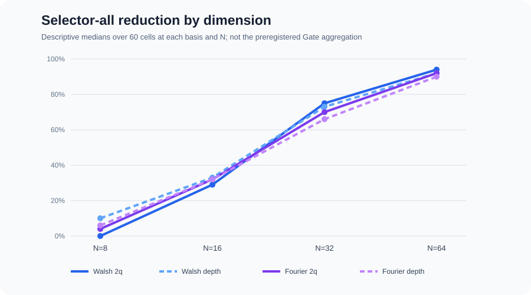
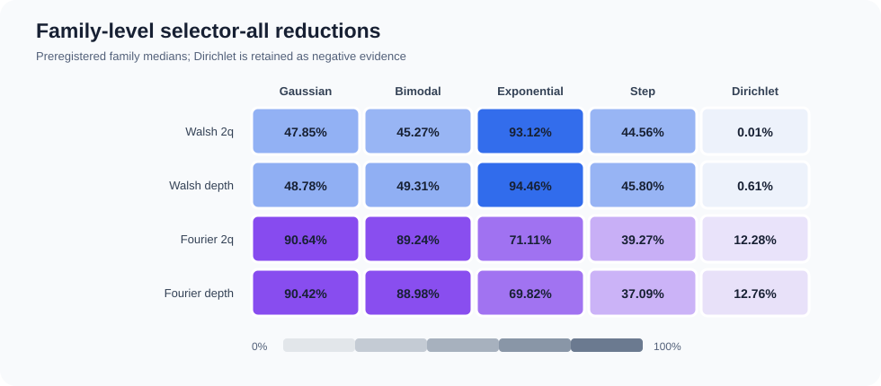

# QSEncode-Insight benchmark visual summary

This page presents the already frozen Locked Generalization Test. It does not
rerun the benchmark, introduce a new metric, or replace the preregistered gate.
The main design contained 60 independent distribution-design instances and 480
evaluation cells across five equally weighted families, `N={8,16,32,64}`, and
separately selected Walsh and Fourier modes.

The dimension view is descriptive: each point is the median over the 60 cells
at that basis and dimension. It must not be substituted for the preregistered
instance → family → basis aggregation.

| Basis | N | Cells | `DO_NOT_COMPRESS` | Median 2q reduction | Median depth reduction |
|---|---:|---:|---:|---:|---:|
| Walsh | 8 | 60 | 15 | 0% | 10% |
| Walsh | 16 | 60 | 10 | 29% | 33% |
| Walsh | 32 | 60 | 4 | 75% | 73% |
| Walsh | 64 | 60 | 6 | 94% | 92% |
| Fourier | 8 | 60 | 18 | 4% | 6% |
| Fourier | 16 | 60 | 2 | 32% | 32% |
| Fourier | 32 | 60 | 0 | 70% | 66% |
| Fourier | 64 | 60 | 0 | 92% | 90% |

The family values are the preregistered family medians. Dirichlet is retained
as negative evidence rather than removed from the pooled result.

| Basis / endpoint | Gaussian | Bimodal | Exponential | Step | Dirichlet |
|---|---:|---:|---:|---:|---:|
| Walsh 2q | 47.85% | 45.27% | 93.12% | 44.56% | 0.01% |
| Walsh depth | 48.78% | 49.31% | 94.46% | 45.80% | 0.61% |
| Fourier 2q | 90.64% | 89.24% | 71.11% | 39.27% | 12.28% |
| Fourier depth | 90.42% | 88.98% | 69.82% | 37.09% | 12.76% |

## Refusal and method mix

- `425/480` cells selected compression; `55/480` (`11.46%`) returned
  `DO_NOT_COMPRESS` and contributed zero gain to `selector-all`.
- The 425 compressed winners comprised 134 `amplitude_encode`, 260
  `sparse_isometry`, and 31 `ds_quantum_state_preparation` selections.
- Constructor incompatibilities were preserved and filtered before selection;
  they were not counted as successful candidates.

## Attribution

Attribution is descriptive over compressed cells and uses `dense_full` as the
denominator. It separates fidelity-budget truncation from the incremental effect
of preparation-strategy choice.

| Basis / resource | Truncation mean | Preparation mean | Total mean |
|---|---:|---:|---:|
| Walsh compiled 2q | -0.07% | 48.76% | 48.69% |
| Walsh compiled depth | 4.79% | 46.34% | 51.13% |
| Fourier compiled 2q | 41.46% | 16.85% | 58.31% |
| Fourier compiled depth | 41.46% | 16.54% | 57.99% |

## Claim boundary

These results support compiled-resource decisions only within the frozen
Python 3.14.2 / PyQPanda3 0.3.5 environment, the five tested families,
`N<=64`, and explicitly selected Walsh or Fourier mode. They do not establish
quantum advantage, hardware runtime acceleration, behavior beyond the tested
scope, or an automatic cross-basis selector.
